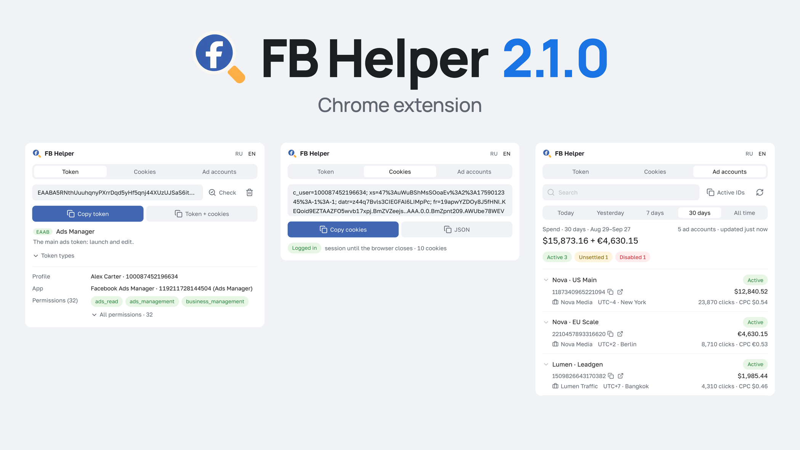

# FB Helper 2.1.0



Chrome extension (MV3): Facebook access token, session cookies and ad account status in one popup. Read-only — it never changes anything in your ads.

## Install

1. **Code → Download ZIP** and unpack (or `git clone`)
2. `chrome://extensions` → enable **Developer mode**
3. **Load unpacked** → pick the unpacked folder (keep the folder after installing)

Chrome 121+. A Facebook tab must be open in the same profile; the ads token (EAAB) comes from `adsmanager.facebook.com`.

## Features

- **Language** — English and Russian, `RU · EN` toggle in the header. The first run follows the browser's UI language; after that the choice is yours, stored in `chrome.storage.local`, and survives a browser restart. English account statuses and disable reasons use the Marketing API names (`Unsettled`, `Ads integrity policy`, …), the same as Ads Manager.
- **Token** — reads the token from the open FB tab and shows its type: EAAB (Ads Manager), EAAI (Automated Rules), EAAG (Business Manager), EAAH (Commerce Manager), EAAd (Events Manager). Each type links to the page where that token lives. **Check** shows the profile, the app and the permissions behind the token.
- **Cookies** — as a header string or as JSON with attributes for importing into a browser profile; **Token + cookies** copies both in one block.
- **Ad accounts** — status, disable reason, spend per period (today / yesterday / 7 / 30 days / lifetime), clicks and CPC, daily limit, billing threshold, payment method, pixels, business owner; ads with statuses and rejection reasons. The loaded list and ads are kept until the browser closes and survive FB tab or token changes; logging in as another FB user drops them.

## Safety and limits

- Requests go only to `graph.facebook.com` and only on a button press. The token is shown only while an open Facebook tab has it and is never stored beyond the browser session.
- The account list refreshes at most once a minute, one account's ads at most once per 30 s. On an API rate-limit error all requests stop for 30 min.
- Graph API version: `v26.0`. When Meta retires it, the extension switches to the newer version Graph names.

## Build the archive

```
git ls-files -co --exclude-standard | grep -v '^\.git' | grep -v '^docs/' | grep -v '\.zip$' | zip -q fb-helper-2.1.0.zip -@
```

Icons: Lucide (ISC). Font: Golos Text (SIL OFL 1.1). Licenses sit next to the files.
